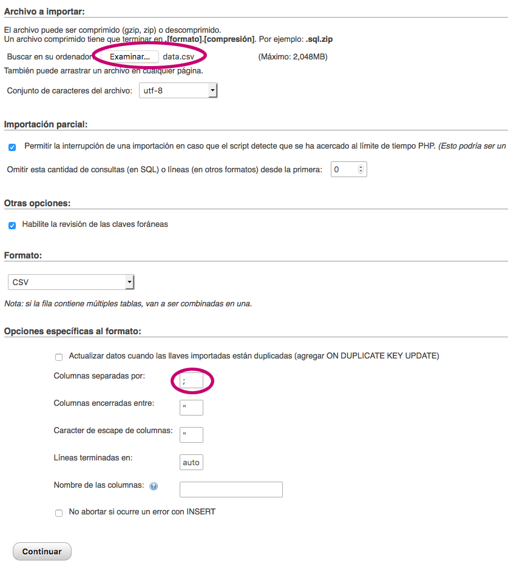

# states-france-germany-prestashop
<h2>States of France and Germany for Prestashop 1.6</h2>

Prestashop Localizations Package of France and Germany don´t contain States.

So <a href="https://github.com/joseRamonLeon/states-france-germany-prestashop/tree/master/csv/zoneEuropeFranceGermanyPrestashop"><strong>Here</strong></a> you have a <strong>CSV</strong> with those states.

<h3>How to Import these States?</h3>

1 You have to manager your Prestashop BBDD with PhpMyAdmin

2 Go to the Table "prestashop_state" and tag: Import and Let´s Import the File like the next Image.

 

 

3 Now go to the BackOffice of Your Prestashop Shop and let´s see if the new states appear

Source information:

https://www.aggdata.com/free/germany-postal-codes  
https://www.aggdata.com/free/france-postal-codes 
 
https://es.wikipedia.org/wiki/ISO_3166-2:DE 
https://en.wikipedia.org/wiki/ISO_3166-2:FR 